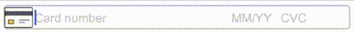

# **rn-cc-input**
This package contains a React Native component to input a credit card data.   
Example of code:
```javascript
import React from 'react';
import {SafeAreaView} from 'react-native';
import CreditCard from 'rn-cc-input';
import styles from './styles';

export default () => (
    <SafeAreaView>
        <CreditCard style={[{margin:10}, styles.textInput]} />
    </SafeAreaView>
);
```
The display:  
 

### **Props**
All props are optional. There are some props dealing with style. You must use them carefully to prevent the messed layout.

|Name                       |Type            |Description                                              |Default Value      |
|---------------------------|-----------------|--------------------------------------------------------|-------------------|
|`cardHolderText`           |`string`         |The text that will be displayed on the card holder field|"Card holder name" | 
|`ifValidNumberNext`        |`boolean`        |When you type a value for a field and it reaches the max length for that field, the focus will move to the next field. But sometimes for card number, before it reaches the max length, the number has been considered as a valid value. If this prop is `true`, when the number is already valid, the focus will move to the next field (CVC field) even if it doesn't reach the max length yet.|`false`|
|`numberText`               |`string`         |The text that will be displayed on the card number field|"Card number"      |
|`placeholderTextColor`     |`ColorValue`     |The color of placeholder text on all fields             |                   |
|`placeholderTextColorError`|`ColorValue`     |The color of placeholder text on all fields when the input is invalid|      |
|`postalCodeText`           |`string`         |The text that will be displayed on the postal code field|"Postal code"      |
|`showCardHolder`           |`boolean`        |Whether to show the card holder field or not (`true` is to show it)|`false` |
|`showPostalCode`           |`boolean`        |Whether to show the postal code field or not (`true` is to show it)|`false` |
|`style`                    |`TextInput` style|The style for input. All style properties that are applicable to `View` component will be set to the input's top container and the rest to all field inputs (card number, expiry date, CVV, holder name and postal code)                                                                                                  ||
|`styleArrow`               |`View` style     |The style for the scrolling button. If the credit card input can't display all fields, there will be the scrolling button(s) to slide to the right and to the left                                              ||
|`styleArrowError`          |`View` style     |The style for the scrolling button when the input is invalid||
|`styleError`               |`TextInput` style|The style for input. All style properties that are applicable to `View` component will be set to the input's top container and the rest to all field inputs                                                         ||
|`styleField`               |`TextInput` style|The style for all field inputs. It overrides `style` props||
|`styleFieldError`          |`TextInput` style|The style for all field inputs when invalid. It overrides `styleError` prop||
|`styleIcon`                |`Image` style    |The style for the card image                            ||

### Properties and method of `ref` object
##### Properties
- `isValid` is `true` if all fields are valid, `false` if any invalid field.
- `value` can be `null` or an object whose the following properties:
  ```
    {
        number: string,
        expired: {
            month: number,
            year: number,
        },
        cvc: string,
        cardHolder: string,
        postalCode: string,
    }
  ```

##### Method
- `setValidationError(isError)` is to set the validity status of credit card input. If `isError` is `true` then
  the status is invalid, the input appearance will use the error style specified in props.

The example of usage:
```javascript
import React from 'react';
import {Button, SafeAreaView} from 'react-native';
import CreditCard from 'rn-cc-input';
import server from './server';

export default () => (
    const cc = React.useRef(null);

    <SafeAreaView>
        {
           //.... Here, there may be the other inputs for transaction 
        }
        <CreditCard ref={cc} />

        <Button title="Send" onPress={async () => {
            const ccInput = cc.current;
            if (ccInput.isValid) { //passes client-side validation
                ccInput.setValidationError(false);
                if (await server.sendTransaction({
                    ccData: ccInput.value,
                    //... collects the other input data
                })) {
                    //The transaction is succesfull. It may be redirected to another page
                }
                else {
                    //Not successfull. If it's because credit card data is invalid (exceeds the limit, wrong holder name, etc.)
                    //We can show the validity status
                    ccInput.setValidationError(true);
                }
            }
            else {
                ccInput.setValidationError(true);
            }
        }} />
    </SafeAreaView>
);
```